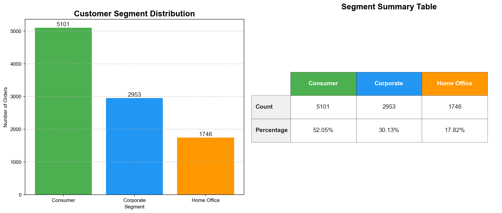

# 🛒 Superstore Sales Analysis

A Python-based exploratory data analysis (EDA) project on the popular **Superstore Sales Dataset**, covering data cleaning, customer segmentation insights, and visualizations.

---

## 📁 Dataset

- **File:** `train.csv`
- **Rows:** ~9,800
- **Source:** [Kaggle - Sample Superstore Dataset](https://www.kaggle.com/datasets/vivek468/superstore-dataset-final)

### Columns Overview

| Column | Description |
|---|---|
| Order ID | Unique identifier for each order |
| Order Date / Ship Date | Order and shipping dates |
| Ship Mode | Shipping category (First Class, Second Class, etc.) |
| Customer ID / Name | Customer details |
| Segment | Consumer, Corporate, Home Office |
| Region / City / State | Geographic data (US-based) |
| Category / Sub-Category | Product classification |
| Product Name | Name of the product |
| Sales | Revenue generated (target variable) |

---

## 🛠️ Requirements

```bash
pip install pandas matplotlib
```

---

## 🚀 How to Run

```bash
python analysis.py
```

> Make sure `train.csv` is in the same directory as `analysis.py`.

---

## 📊 What the Script Does

### 1. Data Loading & Inspection
- Loads the dataset using `pandas`
- Prints first 5 rows, column info, and null value counts

### 2. Data Cleaning
- Fills missing numeric values with **column mean**
- Fills missing categorical values with **column mode**
- Handles `Postal Code` separately using mode imputation

### 3. Exploratory Analysis
- **City-wise order count** — which cities have the most orders
- **Segment-wise distribution** — Consumer vs Corporate vs Home Office

### 4. Visualization
- Left panel: **Bar Chart** — Customer Segment Distribution with value labels
- Right panel: **Summary Table** — Count & Percentage per segment
- Color-coded: 🟢 Consumer &nbsp;|&nbsp; 🔵 Corporate &nbsp;|&nbsp; 🟠 Home Office
- Output saved as `segment_analysis.png`

---

## 📈 Output



### Segment Summary

| Segment | Count | Percentage |
|---|---|---|
| Consumer | 5101 | ~52% |
| Corporate | 2953 | ~30% |
| Home Office | 1746 | ~18% |

> **Consumer** segment dominates with more than half of all orders.

---

## 📂 Project Structure

```
├── analysis.py            # Main analysis script
├── train.csv              # Dataset (download from Kaggle)
├── segment_analysis.png   # Output chart (auto-generated)
└── README.md              # Project documentation
```

---

## 👤 Author

**Aditya**  
B.Tech CSE | Siddharth Institute of Engineering and Technology, Tirupati  
[LinkedIn](#) • [GitHub](#)

---

## 📝 License

This project is open source and available under the [MIT License](LICENSE).
